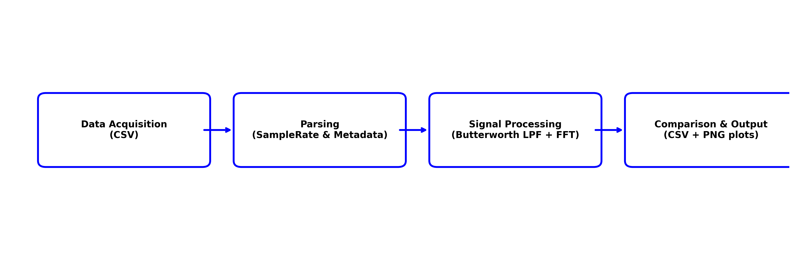

# Vibration Analysis Workflow: Cantilever Beam SHM

This document outlines the signal processing and data analysis workflow for the Structural Health Monitoring (SHM) of FBG-based cantilever beams.

## 1. Data Acquisition

Waveform data is captured using a digital oscilloscope from FBG sensors mounted on cantilever beams of varying lengths (30mm, 40mm, 50mm, 60mm, and 70mm). The shaker provides controlled excitation from 2 Hz to 5 Hz [cite: User Upload].

- Input: RAW CSV files containing Sample Rate, Horizontal Resolution, and Voltage traces for CH1 (Output) and CH2 (Input) [cite: fft_scripit.py, filter-signal.py].
- Sampling: The system extracts the SampleRate or calculates it from HResolution to establish the correct time-base [cite: filter-signal.py].

## 2. Signal Processing Pipeline

To isolate the mechanical resonance and remove high-frequency noise, a digital signal processing (DSP) pipeline is implemented in Python.

### A. Digital Filtering

A 4th-order Low-Pass Butterworth Filter is applied to the raw signal [cite: filter-signal.py].

- Cutoff Frequency ($f_c$): 10.0 Hz (designed to preserve 2-5 Hz vibration while suppressing sensor noise) [cite: filter-signal.py].
- Implementation: Uses scipy.signal.filtfilt for zero-phase distortion, ensuring peaks in the time domain align perfectly with the raw data [cite: filter-signal.py].

### B. Spectral Analysis (FFT)

A Fast Fourier Transform (FFT) converts the time-domain voltage signals into the frequency domain to identify dominant modes [cite: fft_scripit.py].

- Normalization: Amplitudes are normalized to represent peak voltage levels ($2.0 / n$) [cite: fft_scripit.py].
- Band-Limiting: The spectrum is focused on the 0 Hz to 40 Hz range for clear visualization of structural harmonics [cite: filter-signal.py].

## 3. Workflow Flowchart

The following diagram illustrates the automated batch processing logic:

## 4. Visualizing Results

The workflow generates comparative visualizations to validate the filtering logic.

- Time Domain Comparison: Displays the Raw vs Filtered trace. The filtered signal removes the high-frequency jitter (fuzziness) while maintaining the 1.7 Hz fundamental frequency [cite: filter-signal.py].
- Frequency Domain Comparison: Demonstrates the effectiveness of the 10 Hz cutoff by showing suppression of high-frequency noise peaks while preserving the clean mechanical fundamental peak [cite: filter-signal.py].

## 5. Summary of Key Parameters

| Parameter | Setting | Purpose |
| :--- | :--- | :--- |
| Beam Lengths | 30 - 70 mm | Independent variable for resonance testing [cite: User Upload]. |
| Test Freqs | 2 - 5 Hz | Targeted excitation range [cite: User Upload]. |
| LPF Cutoff | 10.0 Hz | Noise suppression for SHM data [cite: filter-signal.py]. |
| FFT Range | 0 - 40 Hz | Spectral window for vibration analysis [cite: filter-signal.py]. |
